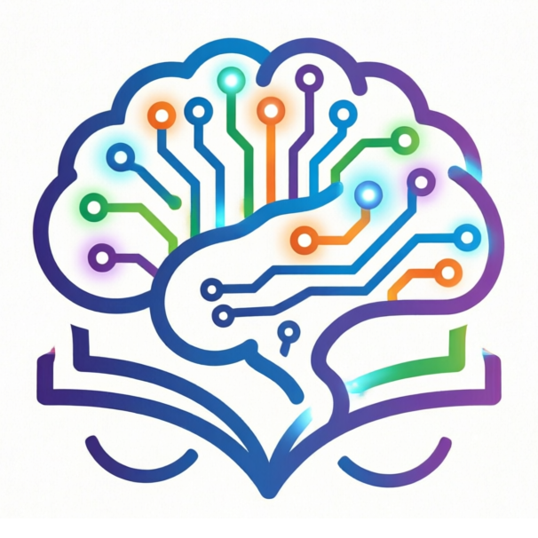

  

<h1 align="center">智学伴 ZhiXueBan</h1>

  <strong>基于生成式人工智能的异步学习解决方案</strong> 
  数智融合 · 创赢未来 · 以 AI 之力重塑每一个学生的学习体验

  <a href="https://zhi-xue-ban.vercel.app/">🌐 在线体验</a> &nbsp;|&nbsp;
  <a href="https://github.com/YHSome/ZhiXueBan/releases">📦 下载桌面版</a> &nbsp;|&nbsp;
  <a href="docs/WHITEPAPER.md">📄 技术白皮书</a> &nbsp;|&nbsp;
  <a href="docs/FEATURES.md">📸 功能展示</a> &nbsp;|&nbsp;
  <a href="docs/OVERVIEW.md">📋 精简版</a>

> ℹ️ 当前为**完整版**（竞赛申报书格式）。只想快速了解功能和快速开始？→ [📋 精简版](docs/OVERVIEW.md)

---

## 🏆 揭榜挂帅 · 命题一

> **广州大学第二届"庆园杯"人工智能创新应用大赛 — 揭榜挂帅赛道**
>
> **命题：基于生成式人工智能的异步学习解决方案**

### 时代之问

2024 年，教育部等五部委联合印发《"人工智能+"行动计划》，明确提出"培养适应智能时代的拔尖创新人才，推进人工智能与教育深度融合"。2025 年，《新一代人工智能发展规划》进入全面深化阶段，AI 赋能教育数字化转型已从远景蓝图走向落地攻坚。

然而，审视当前在线教育现状，三大结构性矛盾依然突出：

| 矛盾 | 表现 | 深层原因 |
|------|------|---------|
| **被动灌输 vs 主动建构** | 学生反复观看录播视频、阅读电子文档，缺乏主动输出与深度加工 | 现有平台停留在"内容搬运"层面，未能将认知科学理论转化为产品机制 |
| **千人一面 vs 个性化需求** | 固定进度、统一难度，无法适应不同学生的知识起点、学习节奏与认知风格 | 缺乏智能化的诊断、适配与动态调整能力 |
| **图文割裂 vs 多维理解** | 理科内容中函数图像、几何关系与文字描述分离，学生需在多个工具间跳转 | AI 文本生成与数学可视化之间存在工程鸿沟 |

**智学伴**正是在这一时代背景下应运而生——它不是又一款"AI+内容"的浅层工具，而是从认知科学底层逻辑出发、以生成式 AI 重构学习全流程的深度解决方案。

### 我们的回答

智学伴以**费曼学习法（以教促学）** 为内核设计理念，构建了覆盖"预习→测验→批改→练习→以教促学→通关"的六阶段完整闭环。学生不是知识的被动接收者，而是需要在 AI 面前**主动讲解、经受追问、证明理解**的学习主体。这一设计直接将学习金字塔中留存率最高的"教授他人"策略系统化、产品化，实现了从"看会了"到"讲清楚了"的质变。

### 真正的"一生一案"：AI 时代的教育公平答卷

我们坦率地承认：当前的生成式 AI 在情感交流、临场判断、肢体语言等维度上，与真人一对一家教之间仍存在距离。

但我们也坚定地看到：**优质家教资源的稀缺性与不可复制性，恰恰是 AI 最能弥补的鸿沟。**

在传统教育生态中，"一对一因材施教"是只有少数家庭能够负担的奢望——一线城市中学生的单科家教时薪普遍在 150-300 元之间，一个学期的辅导费用动辄数千甚至上万元。对于粤港澳大湾区内教育资源相对薄弱的地区、对于普通工薪家庭来说，这笔费用几乎等同于一道无形的教育门槛。

智学伴以生成式 AI 的力量，将这道门槛降到了几乎可以忽略的程度：

| 维度 | 传统一对一家教 | 智学伴 AI 方案 |
|------|-------------|-------------|
| **单次学习成本** | 150-300 元/小时 | 约 0.05-0.5 元（Token 费用） |
| **覆盖学科** | 受限于教师本人的专业背景 | 任意学科，从高等数学到思政理论 |
| **可及性** | 受地域、时间、经济条件严格限制 | 随时随地，有浏览器即可 |
| **学习规划** | 依赖教师经验，难以量化追踪 | 六阶段闭环自动诊断薄弱点，数据驱动精准出题 |
| **情绪压力** | 面对真人可能紧张、不敢犯错 | AI 无评判态度，学生敢于尝试和犯错 |
| **规模化** | 一位教师同时只能辅导一人 | 理论上可同时服务无限学生 |

**一生一案，不是口号。**

传统课堂中，一位教师面对数十名学生，只能按照"中等水平"的预设节奏推进。每个学生的知识漏洞、认知节奏、兴趣方向各不相同，但在统一进度的碾压下，这些差异被一一抹平。学习快的学生被迫等待，跟不上的学生被无声抛弃。

智学伴的四档自适应难度系统、薄弱点自动诊断和针对性出题机制，使得每个学生的学习路径都是**唯一的、动态优化的**——不是简单地"快慢分组"，而是基于每一次练习和批改的反馈数据，实时调整下一轮的难度、题型和侧重方向。学生 A 在"二次函数图像"上反复出错，系统自动增加该知识点的练习密度；学生 B 已经熟练掌握，系统直接推送更高阶的综合应用题。**一个学生，一份教案，一条路径。**

**低成本，不是低质量。**

智学伴的单次学习成本仅为传统家教的千分之一到百分之一。以 DeepSeek v4-pro 为例，一次完整的学习循环（授课 + 出题 + 批改 + 练习 + 教促学）的总 Token 消耗约在 5-20 万之间，折合费用约 0.1-0.4 元人民币。这意味着一个学期的每日 AI 辅导，总费用可能不超过一杯奶茶的价格。这不是技术演示——**这是真正可规模化、可持续运行的教育平权方案。**

### 图文并茂：打破理工类 AI 教学的"纯文字"天花板

传统生成式 AI 在教育领域的应用存在一个隐形的天花板——**文字生成 AI 能写出漂亮的解题步骤，却画不出一条函数曲线。** 当学生面对二次函数的开口方向、三角函数的周期性、双曲线的渐近线、三维曲面的空间形态时，纯文字描述如同用语言去描绘一幅画——再精确的文字也无法替代眼睛看到图像的瞬间理解。

解决这个问题的常规思路是接入图像生成模型（如 DALL·E、Midjourney），但这面临两个致命缺陷：(1) **成本暴涨**——图像生成模型的 Token 费用是文字模型的数十倍甚至上百倍，每次出图都是一笔显著开销；(2) **准确性无法保证**——图像生成模型不"理解"数学，生成的函数图像可能存在坐标轴错位、曲线变形、标注错误等问题，在教学场景中反而会误导学生。

**智学伴走了一条更聪明也更具创新性的路。**

我们不使用图像生成 AI。我们让文字生成 AI 以结构化的 `[graph]` 标记输出数学表达式，然后通过自建的 **Python + matplotlib 渲染引擎** 将其转换为精确的函数图像。这条技术路径带来了三个突破性优势：

| 维度 | 图像生成 AI（DALL·E 等）| 智学伴方案（文字AI + 数学渲染）|
|------|----------------------|---------------------------|
| **单次出图成本** | 0.1-1 元/张 | 约 0.002 元/张（仅消耗文字 Token + 本地 CPU 渲染）|
| **数学精度** | 不可控，曲线可能失真 | 精确可控，基于 numpy 数值计算 |
| **图像类型** | 仅能生成静态图 | 支持显函数、隐式方程、分段函数、多函数对比、三维曲面 |
| **标注与标记** | AI 自由发挥，不可靠 | 断点开闭区间自动标注、坐标轴等比缩放 |
| **失败处理** | 无法调试，只能重新生成 | 错误详情透传，AI 可自动修正 |

这意味着智学伴以**文字生成 AI 的成本，获得了数学可视化教学的完整体验**。学生在讲义中看到的不仅是文字描述——抛物线开口向上还是向下、分段函数的跳跃间断点在哪里、三维曲面在空间中如何延展——这些抽象概念都有了直观的图像支撑。

**这就好比吃饭：纯文字的 AI 教学是干瘪的面包，啃得动但索然无味；加入了精确数学图像的教学，则是一顿荤素搭配、营养均衡的知识大餐。** 面包解决温饱，但学生需要的是一顿好饭。

这一技术路线的创新意义不仅在于降本增效，更在于它为 **"文字 AI + 专业领域渲染引擎"的复合架构** 提供了一个可复用的范式——同样的思路可以推广到化学分子式渲染、物理力学示意图、地理信息可视化等更广泛的教育场景。我们不依赖更贵的模型，我们让聪明的架构弥补模型的局限。

### 契合大赛五大目标

#### 目标一：实战性参与，培养拔尖创新人才

大赛要求"培养适应智能时代的拔尖创新人才，帮助学生开展高层次 AI 应用实战训练"。

智学伴的**以教促学闭环**直接回应这一目标：学生在完成练习后，必须向 AI "学生"讲解自己的解题思路，AI 追问验证其理解的深度与逻辑的严密性。这一过程不是简单的"对答案"，而是对学生**批判性思维、逻辑表达与元认知能力**的系统训练——这正是拔尖创新人才的核心素养。平台已覆盖数学、物理、思政、计算机等多个学科，任何知识领域皆可生成高质量的教促学对话。

#### 目标二：赋能教育转型，破解场景痛点

大赛要求"围绕真实场景，以 AI 解决教学痛点、提升管理效率"。

智学伴直击三大痛点：(1) **异步教学场景下的学习质量保障**——六阶段闭环确保每个环节都有 AI 的即时反馈与引导，学生脱离课堂后依然拥有"私人 AI 导师"；(2) **练习与考试的个性化与自动化**——AI 根据学生薄弱点自适应出题，四档难度（简单/基础/进阶/挑战）覆盖从入门到竞赛的完整梯度，每题标注 1-6 星难度；(3) **数学与理工科内容的图文融合**——内建数学图形渲染引擎，讲义与题目中直接嵌入函数图像（2D/3D），打通从符号理解到视觉直觉的认知通道。

#### 目标三：推动协同创新，构建融合生态

大赛要求"打破学科壁垒，推动人工智能与教育、管理、服务等学科交叉融合"。

智学伴本身就是跨学科融合的产物：(1) **认知科学与 AI 工程**——费曼学习法的认知理论指导产品设计，生成式 AI 提供技术实现；(2) **多学科知识覆盖**——平台支持任意学科的课程创建，从高等数学到编程基础，从大学物理到思想政治教育；(3) **多模型生态兼容**——支持 OpenAI、DeepSeek、通义千问、智谱 GLM 等主流大模型接入，学生可根据需求自由选择最优模型组合，体现了开放协同的技术生态理念。

#### 目标四：对接发展大局，服务区域建设

大赛要求"以粤港澳大湾区建设为牵引，聚焦智慧教育，推动 AI 从创新到实际应用"。

**落地场景设想：从蓝图到作战地图。**

我们不只是描述一个宏大的愿景——我们规划了清晰的落地路径。

> **场景一：粤东西北乡村学校的"AI 助学伙伴"**
>
> 在广东清远、河源、梅州等地的乡镇中学，理科师资结构性短缺是长期难题。一位物理老师可能要同时带三个年级，无法为每个学生提供个性化辅导。我们设想，智学伴可以部署在学校机房或学生自有手机上——学生课后打开浏览器，AI 自动根据当天课堂内容生成复习讲义和练习，遇到不懂的知识点随时向 AI 提问，完成练习后进入以教促学环节向 AI 讲解思路。系统自动生成学习报告，老师可据此精准掌握班级学情，把有限的精力投入到最需要帮助的学生身上。

> **场景二：大湾区社区图书馆的"AI 自习室"**
>
> 在广州、深圳、东莞等城市，公共图书馆和社区服务中心遍布各区。我们设想与这些机构合作，在电子阅览室的电脑上部署智学伴，为放学后无处可去的学生提供一个"AI 陪学"的自习环境。无需安装任何软件，无需注册账号，打开浏览器即可使用。对于父母双职工、无人辅导功课的学生来说，这就是一个永不疲倦、永远耐心的"数字家教"。

> **场景三：广州大学对口帮扶学校的"远程理科实验室"**
>
> 广州大学长期对口帮扶多所基础教育学校。我们设想将智学伴作为帮扶体系中的技术工具，向帮扶学校部署并提供持续的技术支持。通过数学图形渲染引擎，学生在没有专业教师的情况下也能直观理解函数图像、几何关系等抽象概念——这在师资匮乏的学校中尤为重要。

**我们不是在等待"被推广"，我们准备好了"走出去"。**

这不是写在纸上的愿景。智学伴的零服务端架构意味着：任何学校只需一台能上网的电脑，就能获得完整的 AI 教学能力。Windows 桌面 EXE 版本更是为网络条件不佳的地区量身打造。

智学伴在设计之初就立足于**教育公平与资源配置优化**的现实命题。粤港澳大湾区内部教育资源分布不均——优质师资集中在核心城市，偏远地区学生难以获得个性化的学习辅导。智学伴的三大特性直接服务这一需求：(1) **零服务端成本**——数据完全本地存储，无需服务器运维，一台电脑即可部署；(2) **跨平台全覆盖**——Web 端、Vercel 一键部署、Windows 桌面 EXE 三种形态，从城市到乡镇，从电脑到手机，只要有浏览器就能用；(3) **Python 可选依赖**——数学图形渲染为可选功能，无 Python 环境自动降级纯文字模式，确保在任何硬件条件下均可正常使用。

#### 目标五：打通转化通道，搭建成长平台

大赛要求"对接创新大赛与创业孵化，为优秀团队提供成果展示与转化通道"。

智学伴具备完整的落地条件：(1) **开源架构**——完整源码 + 技术白皮书 + 开发指南 + API 文档，任何教育机构可快速二次开发与私有化部署；(2) **成熟产品形态**——Web 端已部署于 Vercel 全球 CDN，桌面端已通过 Electron + Inno Setup 打包为 Windows 安装程序；(3) **可验证的效果**——平台已支持完整的课程创建、学习闯关、AI 批改、教促学对话、试卷测评等功能闭环，具备在教学场景中实际运行的能力。

---

→ 不想读长篇？[📋 一页速览：核心功能、技术创新、快速开始](docs/OVERVIEW.md)

---

## 📄 知识产权 · License

本项目为广州大学第二届"庆园杯"人工智能创新应用大赛参赛作品（揭榜挂帅赛道·命题一）。

MIT © YHSome