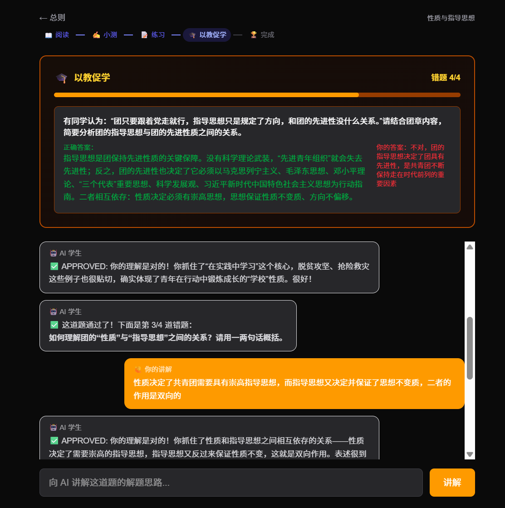
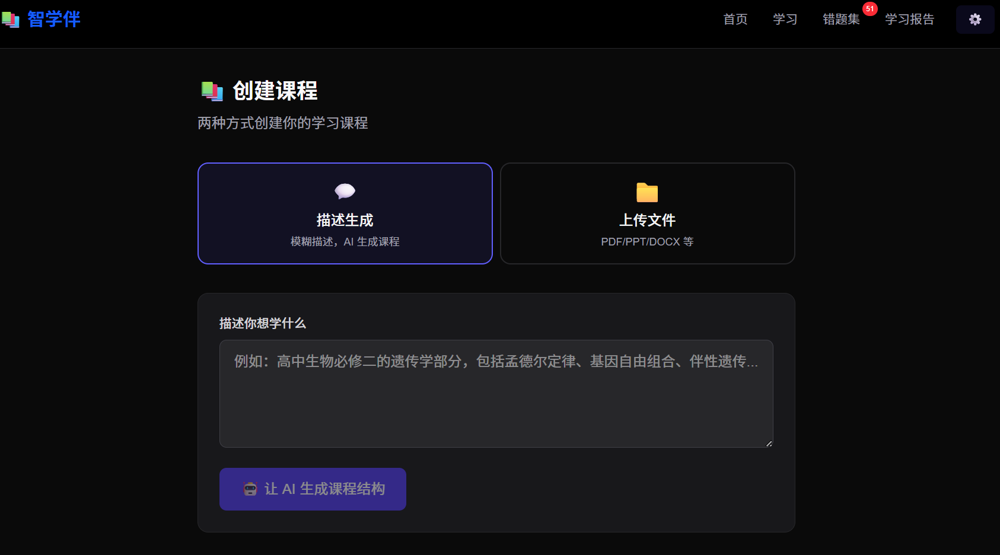
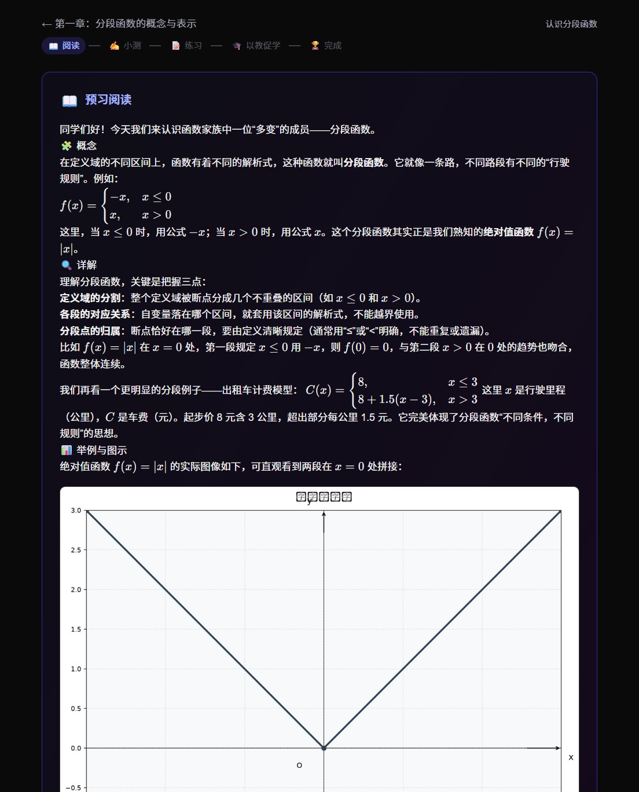
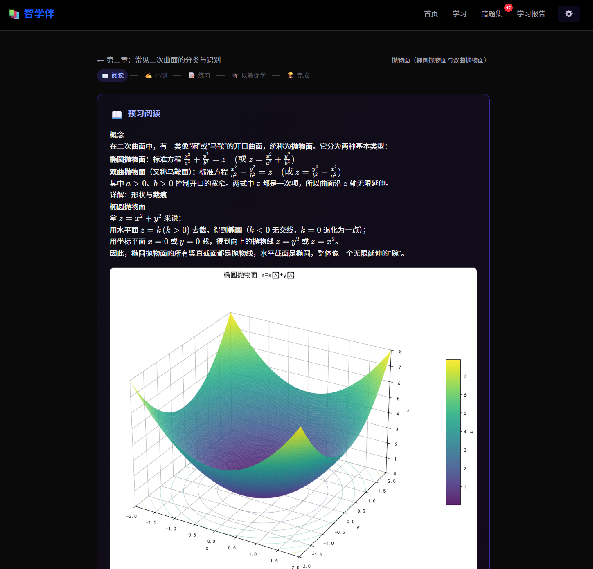
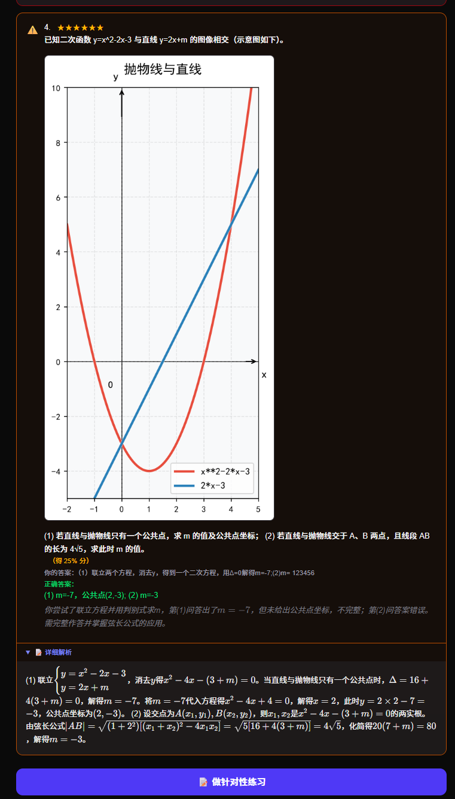
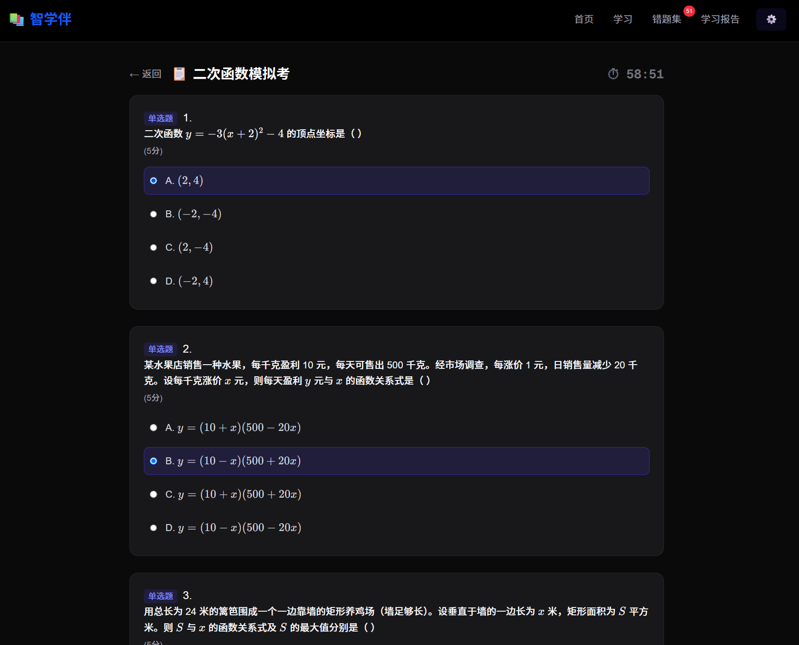
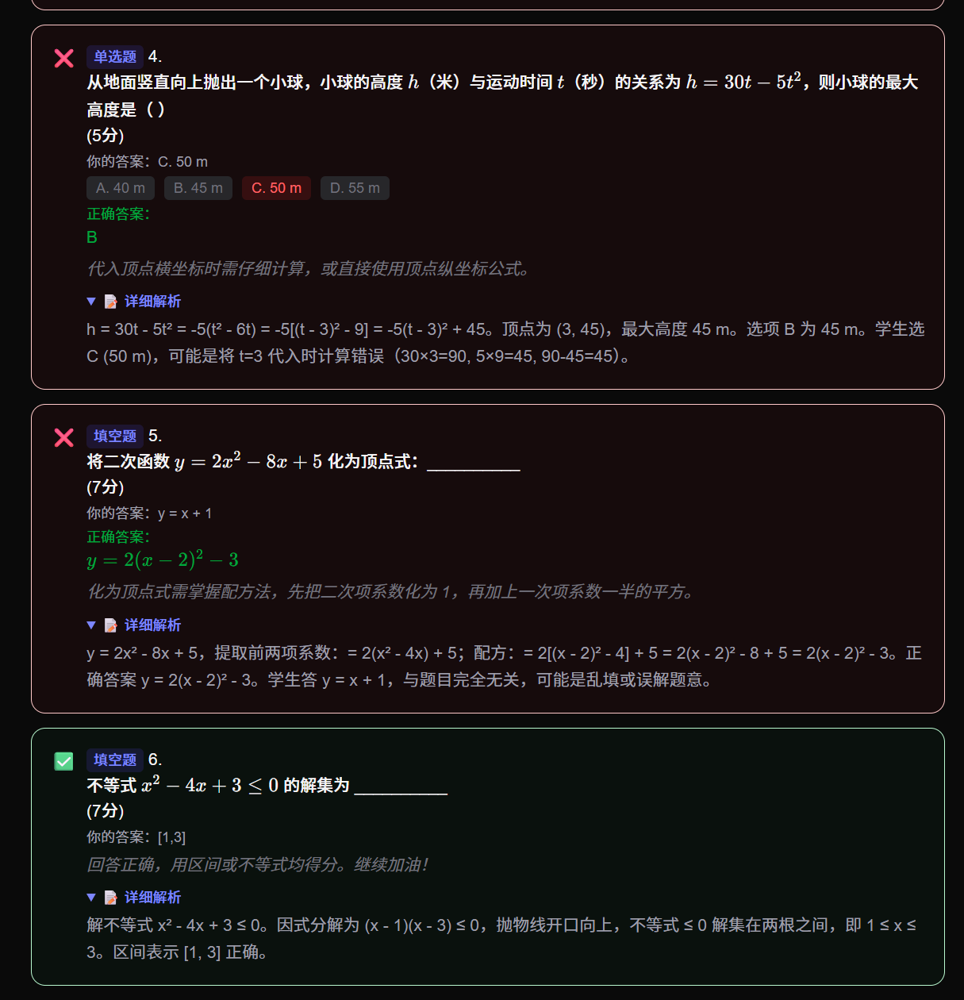
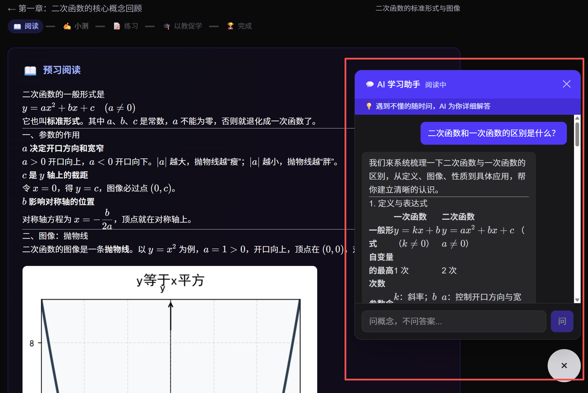
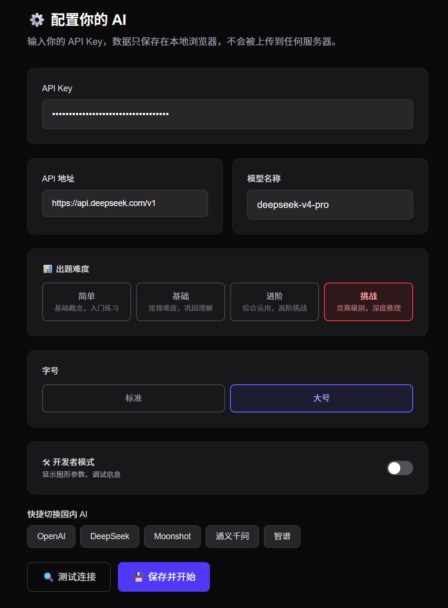

[← 返回主页](../README.md)

# 功能介绍

> 完整功能展示与界面截图

---

## 🎓 以教促学

> 教给别人，才是最好的学习。

以教促学是智学伴的核心特色，灵感来自诺贝尔物理学奖得主理查德·费曼的学习方法。

**工作流程：**

1. 收集小测和练习中的所有错题
2. AI 切换为"学生"角色，学生逐题向 AI 讲解解题思路
3. AI 追问验证，判断学生是否真正理解（而非机械复述答案）
4. 学生回答正确或讲解足够清晰 → ✅ APPROVED → 进入下一题
5. 所有错题讲通 → 🏆 本节通关

**与传统错题本的对比：**

| 传统错题本 | 以教促学 |
|-----------|---------|
| 看一眼答案，抄一遍 | 主动讲解，AI 追问 |
| 被动接受，容易遗忘 | 主动输出，深度理解 |
| 无法验证是否真懂 | AI 追问验证，讲不通不通过 |

<p align="center"></p>

---

## 📖 AI 智能课程创建

支持两种方式创建课程，覆盖不同学习场景：

### 方式一：自然语言描述

输入你感兴趣的任何学科主题，AI 自动设计课程大纲。

- **示例输入**："我想学高中数学二次函数"
- **AI 输出**：课程标题、章节划分（3-8 章）、每章 1-5 个小节
- **灵活性**：支持"简洁一点"、"只要 3 章"等额外需求

### 方式二：文件上传解析

拖拽你的 PDF、DOCX、PPTX 课件，AI 自动：

- 提取文字内容
- 识别章节标题
- 忽略考试通知、行政说明等非知识内容
- 自动补全缺失的小节

```
支持格式：PDF / DOCX / PPTX / HTML
```

<p align="center"></p>

---

## 🎯 六阶段闯关式学习

每个知识小节都是一个独立的学习闭环，全程无干扰：

```
📖 预习阅读           ✍️ 小测验             🔍 AI 批改
  AI 实时生成           3-5 道自适应题          逐题批改
  结构化讲义            标注难度星级            详细解题步骤
  图文并茂                                     分数 + 建议

📝 针对性练习           🎓 以教促学             🏆 通关
  薄弱点智能出题         向 AI 讲解思路          进入下一节
  难度匹配当前设置       AI 追问验证
```

**核心体验设计：**

- **闯关模式**：学习期间左侧目录自动隐藏，避免分心
- **进度保留**：所有阶段数据存在本地，刷新/关闭不丢失
- **灵活跳转**：已完成的阶段可点击进度条跳回查看
- **后台预加载**：讲义生成后自动预生成小测题，切换秒开

<p align="center"></p>

---

## 📐 图文并茂——数学图形渲染

AI 在生成讲义时可直接嵌入函数图像，引导学生更直观地理解抽象概念。

### 支持的五种图形

| 类型 | 何时使用 | 示例 |
|------|---------|------|
| **显函数** | 普通函数 y=f(x)  | `y=sin(x)` · `y=2x+1` |
| **隐式方程** | 圆、椭圆、双曲线  | `x²+y²=1` · `x²/4-y²/9=1` |
| **多函数对比** | 比较不同函数行为  | 三条直线斜率对比 |
| **分段函数** | 出租车计费、阶梯电价 | `x≤3: 8元; x>3: 1.5x+3.5` |
| **三维曲面** | 空间几何、多元函数 | 旋转抛物面 z=x²+y² |

### 技术特性

- **智能断点标记**：分段函数跳跃间断点画空心圆（开区间），连续处无标记
- **自适应比例尺**：x/y 范围差异过大时自动拉伸，保证可读性
- **语法规整化**：API 侧自动修正 AI 常见语法错误（缺乘号、^→** 等）
- **无依赖降级**：未安装 Python 时自动切纯文字模式

<p align="center"></p>

---

## 🧠 AI 自适应难度系统

在设置中选择难度，AI 出题策略即时调整。

### 四档难度

| 难度 | 适用场景 | 出题策略 | 星级 |
|------|---------|---------|------|
| 🟢 简单 | 初次接触，建立信心 | 基础概念，直接应用 | 1-3 ★ |
| 🔵 基础 | 常规学习，巩固理解 | 理解+应用，适度综合 | 2-4 ★ |
| 🔵 进阶 | 查漏补缺，拔高提升 | 综合分析，多步推理 | 3-6 ★ |
| 🔴 挑战 | 竞赛备考，深度探索 | 非常规思路，跨知识点融合 | 4-6 ★ |

### 星级标注

每道题标注 1-6 星难度，学生一目了然：
- ★☆☆☆☆☆ — 基础概念题
- ★★★☆☆☆ — 适度综合
- ★★★★★☆ — 高阶推理
- ★★★★★★ — 竞赛级别

<p align="center"></p>

---

## 📋 试卷系统

模拟真实考试场景，支持两种出卷方式。

### AI 智能出卷

- 根据课程内容自动生成试卷
- 可设定题型分布、题量、限时
- 难度继承设置页选择

### 导入已有试卷

- 上传 Word/PDF 试卷文件
- 原卷呈现：保持原题排版，直接在页面作答
- AI 模仿出题：提取考点，生成风格相似的新试卷

### 考试与练习双模式

| | 考试模式 | 练习模式 |
|------|---------|---------|
| 计时 | ⏱ 倒计时，超时自动提交 | ♾ 不限时 |
| AI 助手 | ⚠️ 只解释概念，不透露答案 | 💡 可详细解答 |
| 提交 | 时间到自动提交 | 手动提交 |

### 批改

- AI 逐题批改（对/错/半对）
- 详细解题步骤（可折叠）
- 薄弱点诊断 + 学习建议

<p align="center"> </p>

---

## 💬 AI 学习助手

右下角悬浮窗，学习全程陪伴。

- **阅读模式**：随时提问，AI 详细解答
- **考试模式**：只解释概念，坚决不透露答案和解题思路
- **对话持久化**：按节保存，下次进入自动恢复
- **LaTeX 支持**：数学公式完美渲染

<p align="center"></p>

---

## 🔒 隐私与安全

| 措施 | 说明 |
|------|------|
| 本地存储 | API Key、课程、试卷、进度全部存在浏览器 localStorage |
| 零上传 | 除 AI API 调用外，无任何数据上传到第三方服务器 |
| 无账号系统 | 不需要注册、不需要登录，数据随浏览器走 |

---

## 📦 多平台交付

| 形态 | 使用方式 | 适用场景 |
|------|---------|---------|
| 🌐 Vercel 部署 | 打开网址即用 | 随时随地，手机电脑均可 |
| 📦 Windows EXE | 下载解压，双击 `智学伴.exe` | 离线使用，内嵌 Node.js 运行时 |
| 💻 源码运行 | `npm run dev` | 开发者调试、二次开发 |


---

## ⚙️ 其他特性

- **字号调节**：标准/大号两档，适配不同屏幕和视力需求
- **Token 计数**：实时显示本次 AI 调用消耗的 Token 量，费用透明
- **LaTeX 公式工具栏**：填空/简答题自动弹出 LaTeX 符号面板
- **开发者模式**：开启后显示图形参数、Python 错误详情、一键修复按钮
- **课程进度条**：首页直观展示每门课的学习进度

<p align="center"></p>
