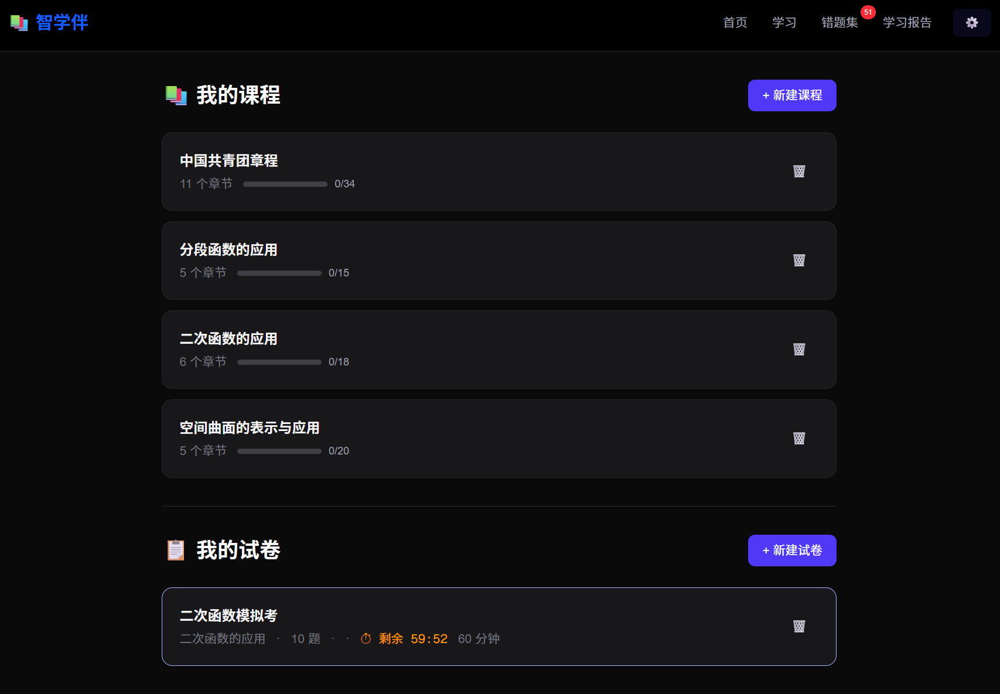

[← 返回主页](../README.md)

# 智学伴 — 技术白皮书

> 基于生成式 AI 的异步学习解决方案

---

## 摘要

**智学伴（ZhiXueBan）** 是一款面向初高中学生的 AI 原生异步学习平台，以 **"以教促学"（费曼学习法）** 为内核设计理念，构建了 "预习→测验→批改→针对性练习→以教促学→通关" 的六阶段闭环学习流程。平台支持自然语言描述或文件上传自动生成结构化课程，内建数学图形渲染引擎实现讲义图文并茂，通过 AI 自适应难度调节实现千人千面的个性化学习体验。系统零服务端成本，数据完全本地化存储，支持 Web 端和 Windows 桌面 EXE 两种交付形态。

**关键词：** 生成式 AI · 以教促学 · 费曼学习法 · 自适应学习 · 数学可视化 · 离线优先

---

## 目录

1. [问题与动机](#1-问题与动机)
2. [核心创新](#2-核心创新)
3. [系统架构](#3-系统架构)
4. [功能设计](#4-功能设计)
5. [技术实现](#5-技术实现)
6. [性能与安全](#6-性能与安全)

---

## 1. 问题与动机

### 1.1 传统在线教育的三大痛点

| 痛点 | 表现 | 智学伴的解法 |
|------|------|------------|
| **被动灌输** | 学生只看视频/读文档，缺乏主动输出 | 以教促学——学生必须向 AI 讲清楚才算掌握 |
| **千人一面** | 固定难度、固定进度，无法适应个体差异 | AI 四档自适应难度 + 薄弱点诊断 + 针对性练习 |
| **图文割裂** | 数学/物理内容文字与图像分离，阅读体验差 | 内建数学图形渲染引擎，AI 讲义自动嵌入函数图像 |

### 1.2 以教促学的认知科学基础

认知科学研究表明，**教给别人**是知识留存率最高的学习方式（学习金字塔顶端，留存率约 90%）。费曼学习法的核心——"如果你不能简单地解释它，你就没有真正理解它"——被嵌入智学伴的学习闭环中。

<p align="center"></p>

---

## 2. 核心创新

### 2.1 六阶段学习闭环

```
预习阅读 → 小测验 → AI 批改 → 针对性练习 → 以教促学 → 通关
```

每个阶段设计目标：

| 阶段 | 目标 | AI 职责 |
|------|------|---------|
| 📖 预习阅读 | 获取新知识 | AI 生成结构化讲义（Markdown + LaTeX + 配图） |
| ✍️ 小测验 | 检测理解 | AI 自适应出题（3-5 题，标注难度星级） |
| 🔍 AI 批改 | 诊断薄弱点 | 逐题批改 + 详细解题步骤 + 分数 + 学习建议 |
| 📝 针对性练习 | 补强短板 | 根据薄弱点生成练习，避免重复原题 |
| 🎓 以教促学 | 深度理解 | 学生向 AI 讲解错题思路，AI 追问验证 |
| 🏆 通关 | 完成标记 | 进入下一节 |

<p align="center"></p>

### 2.2 以教促学——AI 扮演"学生"

这是智学伴最具特色的环节：

1. 收集小测和练习中的所有错题
2. AI 扮演"学生"角色，学生逐题讲解解题思路
3. AI 追问验证，判断是否真正理解
4. **通过条件**：
   - AI 提问，学生回答正确 → ✅ APPROVED
   - 学生讲解足够详细、逻辑清晰 → 直接通过
5. 所有错题讲通，本节才算通关

不同于传统错题本"看一眼答案就算订正"，以教促学强制学生**主动输出**，确保真正的理解。

<p align="center"></p>

### 2.3 数学图形渲染引擎

AI 讲义中可直接嵌入函数图像，支持五种图形类型：

| 类型 | 前缀 | 示例 |
|------|------|------|
| 显函数 | `y=` | `y=sin(x)` |
| 隐式方程 | `eq:` | `x²/4 + y²/9 = 1`（椭圆） |
| 多函数对比 | `multi:` | 三条直线斜率对比 |
| 分段函数 | `pw:` | 出租车计费、阶梯电价 |
| 三维曲面 | `3d:` | 旋转抛物面、马鞍面 |

**技术亮点：**

- 基于 matplotlib + numpy 的 Python 子进程渲染
- API 侧七层预处理自动纠正常见 AI 语法错误（缺乘号、^→**、逗号→分号等）
- 分段函数断点智能检测——区分跳跃间断（空心圆）与连续衔接（无标记）
- 等比例坐标轴智能切换——xy 范围差 3 倍以上自动拉伸
- **自动降级**：无 Python 环境时检测失败，AI 自动切换纯文字模式

<p align="center"></p>

### 2.4 AI 自适应难度系统

四档难度调节，AI 根据选择动态调整出题策略。每题标注 1-6 星难度，让学生清楚自己处于什么水平。

| 难度 | 设计目标 | 星级范围 |
|------|---------|---------|
| 🟢 简单 | 基础概念入门 | 1-3 ★ |
| 🔵 基础 | 理解+应用巩固 | 2-4 ★ |
| 🔵 进阶 | 综合分析+多步推理 | 3-6 ★（至少一道 5★） |
| 🔴 挑战 | 竞赛+深度推理 | 4-6 ★（至少一道 6★） |

<p align="center"></p>

### 2.5 离线优先 + 零服务端成本

- **API Key 本地存储**：所有数据（课程、试卷、进度）存在浏览器 localStorage
- **Electron 桌面版**：双击 EXE 即用，内嵌 Node.js 运行时
- **Vercel 一键部署**：支持 Python 运行时
- **Python 可选依赖**：无 Python 时自动降级纯文字

<p align="center"></p>

---

## 3. 系统架构

```
┌─────────────────────────────────────────────────────┐
│                      前端层                          │
│  React 19 + Next.js 16 (Turbopack) + Tailwind CSS   │
│  ├── 学习主界面（六阶段状态机）                        │
│  ├── 课程创建（自然语言 + 文件解析）                    │
│  ├── 试卷系统（AI 出卷 + 自动批改）                    │
│  ├── MarkdownRenderer（KaTeX + [graph] 块提取渲染）   │
│  └── GeoGebraView（图形渲染 + 一键修复）               │
├─────────────────────────────────────────────────────┤
│                      API 层                          │
│  ├── /api/ai      SSE 流式 AI 调用 + Token 实时计数    │
│  ├── /api/parse   文件解析（Python 子进程）             │
│  └── /api/graph   数学图形生成 + 七层预处理 + ping     │
├─────────────────────────────────────────────────────┤
│                     数据层                            │
│  localStorage（课程/试卷/进度/配置）                   │
│  sessionStorage（图形支持检测缓存）                    │
├─────────────────────────────────────────────────────┤
│                   外部依赖                             │
│  DeepSeek / OpenAI / 通义千问 / 智谱（兼容 API）       │
│  Python + numpy + matplotlib（可选，图形渲染）         │
└─────────────────────────────────────────────────────┘
```

### 关键技术决策

| 决策 | 理由 |
|------|------|
| **Next.js 全栈** | API 路由 + 前端同仓库，降低部署与维护成本 |
| **localStorage 数据层** | 零服务端成本，隐私保护，离线可用 |
| **SSE 流式传输** | AI 响应实时展示，Token 用量透明可控 |
| **Python 子进程图形** | 利用 matplotlib 生态，60+ 预置函数模板 |
| **双模式提示词** | `hasGraph` 参数控制是否启用配图指令 |
| **七层 API 预处理** | 容忍 AI 输出各种格式变体，降低提示词维护成本 |

---

## 4. 功能设计

### 4.1 课程创建

- **模糊描述**："我想学高中数学二次函数" → AI 生成章节
- **文件上传**：拖拽 PDF/DOCX/PPTX → AI 识别拆分

<p align="center"></p>

### 4.2 学习主界面

左侧课程目录树，右侧沉浸式闯关。学习期间隐藏目录，避免分心。顶部六阶段进度条可点击跳转。

<p align="center"> </p>

### 4.3 AI 学习助手

右下角悬浮窗，学习过程中随时提问：
- **考试中**：只解释概念，不透露答案
- **阅读中**：可详细解答

<p align="center"></p>

### 4.4 试卷系统

- **AI 出卷** + **导入试卷** + **考试模式**（倒计时）+ **练习模式**（不限时）
- AI 批改 + 详细解题步骤（可折叠）+ 学习建议

<p align="center"> </p>

### 4.5 后台预加载

讲义生成后，后台异步预生成小测题目；批改完成后，预生成针对性练习。用户切换阶段时秒开，无需等待。

---

## 5. 技术实现

### 5.1 双模式提示词系统

```javascript
// hasGraph=true  → AI 收到完整配图模板
// hasGraph=false → AI 只看到纯文字要求
lecturePrompt(title, ch, sec, hasGraph)
quizPrompt(title, lecture, hasGraph, difficulty)
practicePrompt(title, lecture, weakPoints, hasGraph, difficulty)
```

### 5.2 图形渲染管线

```
AI 输出 [graph] 块 → MarkdownRenderer 提取 → GeoGebraView 加载
  → fetch /api/graph
    → 七层预处理（^→** / 逗号→分号 / 缺乘号 / 变量统一 / 标签剥离 / 隐式安全网 / 标题美化）
    → 判断类型（y=/eq:/multi:/pw:/3d:）
    → formula_to_image.py 或 内联 Python 脚本
    → 返回 PNG（blob）
  → 显示图片 / 错误卡片（含 Python 报错详情 + 一键修复）
```

### 5.3 七层 API 预处理

| 层 | 功能 | 示例 |
|----|------|------|
| 1 | 参数标签剥离 | `xmin=0` → `0` |
| 2 | 定义域简写 | `-4<=x<=5` → `-4\|5\|-4\|5` |
| 3 | 变量统一 | `t`/`θ` → `x` |
| 4 | 指数符号 | `^`→`**`, `)2`→`)**2`, `x2`→`x**2` |
| 5 | 乘号补全 | `2x`→`2*x`, `)(`→`)*(` |
| 6 | 常量包装 | `1`→`np.ones_like(x)*(1)` |
| 7 | 等号处理 + 比较符保护 | `x²+y²=1`→`x**2+y**2-1`, `<=` 保留 |

### 5.4 分段函数逐段绘制

不同于单条 `np.where` 曲线（会连接跳跃间断点），分段函数使用内联 Python 脚本逐段独立绘制：

- 每段在各自 x 区间上独立画线
- 断点处比较前后 y 值：跳跃 → 空心圆标记（开区间）+ 实心圆（闭区间）；连续 → 无多余标记

---

## 6. 性能与安全

| 维度 | 措施 |
|------|------|
| **隐私** | API Key + 全部数据存 localStorage，不上传服务器 |
| **费用控制** | Token 实时计数显示，后台预加载减少重复调用 |
| **离线可用** | 已生成内容存在 localStorage，断网可复习 |
| **渲染性能** | 图形 API 临时文件即用即删，不占用磁盘 |
| **兼容性** | 无 Python 环境自动降级，不影响核心学习流程 |

---

> 📄 License: MIT · Built with ❤️ for students who learn by teaching
